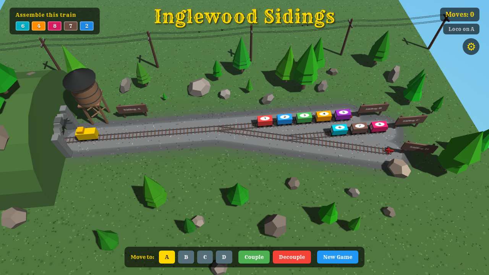

# Inglenook Sidings — 3D Shunting Puzzle

A browser-based 3D railway shunting puzzle built with [Three.js](https://threejs.org/). Assemble a target consist of five cars in the correct order by shunting them across four sidings — a digital take on the classic [Inglenook Sidings](https://en.wikipedia.org/wiki/Inglenook_sidings) puzzle.



## How to Play

1. **Open `index.html`** in a modern browser (no build step required).
2. A random **target consist** of 5 cars (drawn from 8) is shown in the top-left panel.
3. Use the **Move to** buttons (or click a track) to drive the locomotive between sidings.
4. **Couple** cars one at a time from whichever siding the loco is on.
5. **Decouple** all coupled cars onto the current siding to rearrange.
6. Match the target order exactly to win.

### Controls

| Action | How |
|--------|-----|
| Move loco | Click a track or press a **Move to A/B/C/D** button |
| Couple a car | Press **Couple** (takes the nearest car on the siding) |
| Decouple all | Press **Decouple** (drops all coupled cars onto the current siding) |
| Orbit camera | Click and drag the scene |
| Zoom | Scroll wheel |
| New game | Press **New Game** |

### Rules

- The loco lives on track **A** (the headshunt) and can visit any siding (**B**, **C**, **D**).
- From a siding you can only return to **A** — no direct siding-to-siding moves.
- Decoupling is not allowed on the headshunt.
- Each siding has a car capacity limit — you cannot move onto a track if your coupled cars would exceed it.

## Track Layout

```
            ← A (headshunt, 14 units) ─── throat ─── B (14 units) →
                                            SP1
                                             ╲  15°
                                              SP2 ─── C (10 units) →
                                               ╲  15°
                                                D (10 units) →
```

Tracks A and B are colinear. C is parallel to B. D continues the diagonal at 15°.

## Tech Stack

- **Three.js r152** — 3D rendering (WebGL)
- **OrbitControls** — camera interaction
- **Vanilla JS** — no frameworks, no build tools
- **HTML / CSS** — HUD overlay and buttons

## Project Structure

```
├── index.html          Entry point
├── js/
│   ├── config.js       Constants, car colors, dimensions
│   ├── tracks.js       Track geometry, routing, positioning
│   ├── scene.js        Three.js renderer, camera, lighting
│   ├── entities.js     Locomotive, cars, rails, scenery
│   ├── gameState.js    Game logic, coupling, win condition
│   ├── hud.js          UI updates, victory overlay, error toasts
│   ├── animation.js    Polyline path-following movement
│   ├── interaction.js  Click handling, button wiring
│   └── main.js         Bootstrap / init
└── lib/
    └── three/          Three.js + OrbitControls (vendored)
```

## License

MIT
